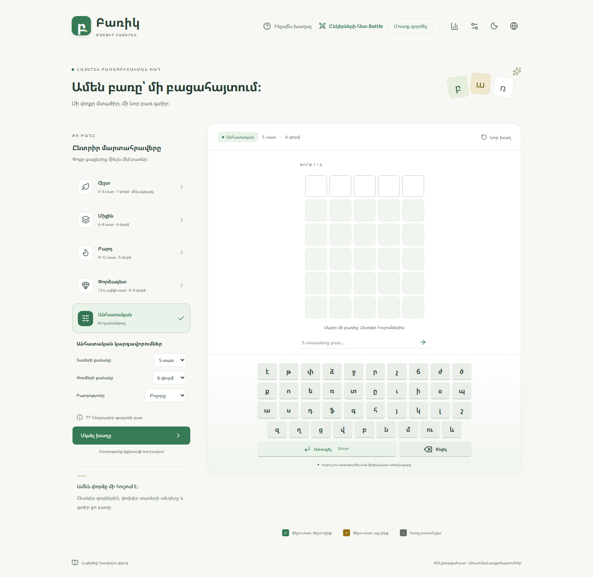
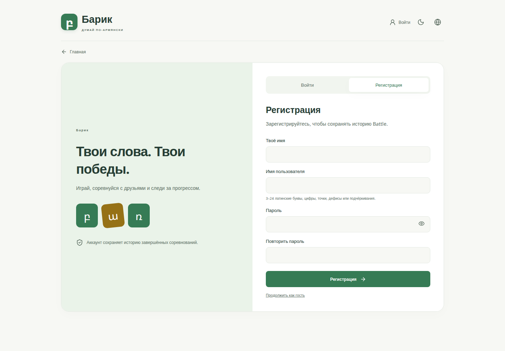
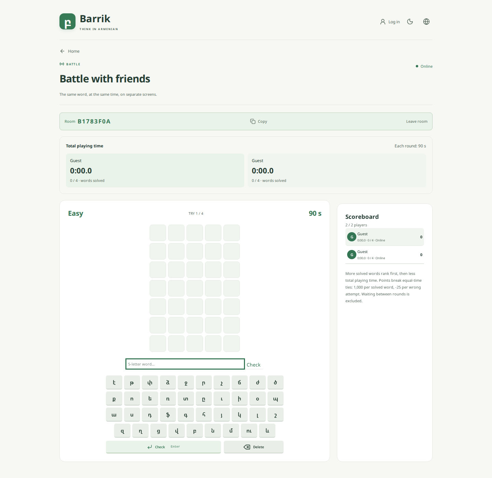

<div align="center">

# Բառիկ · Barrik

**Հայերեն բառեր։ Ընկերական մրցակցություն։ Ամեն օր՝ նոր բացահայտում։**

[Խաղալ առցանց](https://armworldgame.duckdns.org) · [Գրանցվել](https://armworldgame.duckdns.org/#register) · [Battle](https://armworldgame.duckdns.org/#battle)

React · TypeScript · WebSocket · PWA

</div>



## Խաղա քո ձևով

| Մենախաղ                                     | Battle                                        | Քո հաշիվը                        |
| ------------------------------------------- | --------------------------------------------- | -------------------------------- |
| Հեշտ, միջին, բարդ, փորձագետ և անհատական խաղ | 2–8 մասնակից՝ տարբեր սարքերից                 | Գրանցման և մուտքի առանձին էջեր   |
| 3–21 տառանոց հայերեն բառեր                  | Նույն բառերը՝ չորս հերթական փուլերում         | Թարմացումից հետո պահպանվող մուտք |
| Էկրանային և ֆիզիկական ստեղնաշար             | Սենյակի կոդով հրավեր կամ բաց սենյակի որոնում  | Ավարտված Battle-ների պատմություն |
| Կրկնվող տառերի ճիշտ գնահատում               | Ժամանակ, փորձերի սահման և ընդհանուր միավորներ | Ելք և այլ սարքից մուտք           |

Կայքի միջերեսը հայերեն, անգլերեն և ռուսերեն է։ **Խաղի բառերը միշտ հայերեն են։** Լուսավոր ու մութ թեմաները, ստեղնաշարով հասանելի պատուհանները և փոքր էկրաններին հարմարեցված վանդակները գործում են ամբողջ կայքում։



## Battle-ի կանոնները

1. Ստեղծիր սենյակ և ուղարկիր կոդը ընկերներիդ, կամ գտիր բաց սենյակ։
2. Առնվազն երկու մասնակից միանալուց հետո սենյակը ստեղծողը սեղմում է «Սկսել Battle-ը»։
3. Անցեք չորս փուլ՝ հեշտ → միջին → բարդ → փորձագետ։ Ստեղծողն ընտրում է յուրաքանչյուր փուլի ժամանակը՝ 1–3600 վայրկյան, կամ 0՝ անսահմանափակ։
4. Սերվերն ընտրում և գաղտնի է պահում պատասխանը, ստուգում բառարանը, գնահատում տառերը և սահմանափակում փորձերը։ Մրցակիցների փորձերը չեն ցուցադրվում։
5. Առավելություն ունի ավելի շատ բառ գուշակած մասնակիցը։ Հավասար քանակի դեպքում հաղթում է ավելի քիչ ընդհանուր խաղաժամանակ ծախսածը, ապա համեմատվում են միավորները՝ 1000 գուշակված բառի համար, −25՝ նախորդ սխալ փորձի։ Փուլերի միջև և սեփական փորձերն ավարտելուց հետո սպասումը չի հաշվվում։ Մասնակիցների ժամանակները երևում են խաղադաշտի վերևում և պահպանվում հաշվի պատմության մեջ։



## Տեղային գործարկում

Պահանջվում է **Node.js ≥22.12**։

```bash
npm ci
npm run dev:all
```

Բացիր [localhost:5173](http://localhost:5173)։ Vite-ը `/api/` և `/ws` հարցումները փոխանցում է տեղային Battle ծառայությանը՝ `127.0.0.1:8787`։ Սերվերի և հաճախորդի առանձին գործարկման հրամաններն են `npm run battle` և `npm run dev`։

```bash
npm run build
npm run preview
```

Հաճախորդի ֆայլերը ստեղծվում են `dist/`-ում։ Միայն `dist/`-ի հրապարակումը բավարար է մենախաղի համար։ Գրանցումն ու Battle-ը պահանջում են նաև Node ծառայություն և `/api/`, `/ws` reverse proxy։

## Ստուգումներ

```bash
npm run typecheck
npm run lint
npm test
npm run dictionary:check
npm run test:battle
npm run build
npx playwright install chromium
PLAYWRIGHT_PREVIEW=1 npm run test:e2e -- --workers=1
AUDIT_PREVIEW=1 npm run test:audit
```

- **Unit թեստեր**՝ հայերենի normalization, կրկնվող տառեր, բառարանի վավերացում, բառերի ընտրություն, վիճակագրություն և թարգմանությունների բանալիների համապատասխանություն։
- **Server integration**՝ երկու և երեք մասնակից, չորս փուլ, փորձերի սպառում, սխալ բառեր, կրկնակի մեկնարկի մերժում, սենյակի մաքրում, գրանցում/մուտք/ելք և պահված session-ի վերականգնում։
- **Playwright**՝ երկու անկախ գրանցված բրաուզերների ամբողջ մրցումը, պրոֆիլի պատմություն, refresh, լեզուների փոփոխություն, դատարկ սենյակների ու կապերի մաքրում, մատչելիություն, հեռախոսային չափեր և PWA անցանց մենախաղ։

Աուդիտի փաստերը՝ [docs/AUDIT.md](docs/AUDIT.md), կառուցվածքի քարտեզը՝ [docs/ARCHITECTURE.md](docs/ARCHITECTURE.md), քայլերի մատյանը՝ [docs/SETUP_LOG.md](docs/SETUP_LOG.md)։

## Բառարանի աղբյուրը

Տեղային բառացանկը կազմված է [Hyspell](https://github.com/martakert/hyspell)-ի **CC0** աղբյուրից՝ **65 002 ընդունվող բառով** և **433 առանձին ընտրված պատասխանով**։ Ընտրված պատասխանները համեմատվում են աղբյուրի բառացանկի հետ ավտոմատ ստուգմամբ։ Հայերենը մշակվում է NFC normalization-ով, «ու»-ն և «և»-ը մեկական վանդակ են։ Մեթոդը և աղբյուրի տարբերակը՝ [docs/DICTIONARY.md](docs/DICTIONARY.md)։

## Տեղադրում և տվյալների պահպանում

Հրապարակված տարբերակը աշխատում է Apache + HTTPS/WSS + systemd կառուցվածքով։ Կոդի թողարկումներն առանձին պանակներում են, իսկ հաշիվների տվյալները՝ **`/var/lib/worldgame`**-ում։ Տեղակայման ժամանակ դրանք չեն ջնջվում կամ պատճենվում GitHub։ Գաղտնաբառերը պահվում են scrypt hash-ով, session-ները՝ HttpOnly cookie-ով և սերվերում միայն hash-ով։

PWA աջակցող բրաուզերում կայքը կարելի է տեղադրել որպես հավելված։ Cache-ում պահվում են միայն հանրային ֆայլերը․ հաշիվների պատասխանները չեն պահվում։

### Գործող սահմաններ

- Ծառայությունն աշխատում է մեկ Node process-ով և atomic JSON պահոցով։ Բազմասերվերային մեծ ծանրաբեռնվածության համար անհրաժեշտ է ընդհանուր տվյալների բազա և սենյակների համաժամեցում։
- Battle սենյակը նախատեսված է 2–8 մասնակցի համար։ Կապի կորստից հետո հնարավոր է վերադառնալ lobby, սակայն ընթացիկ մրցման վերականգնում դեռ չկա։
- Հաշվի session-ը և ավարտված Battle պատմությունը պահպանվում են սերվերի վերագործարկումից հետո։ Ընթացիկ սենյակները չեն պահպանվում։
- Մենախաղի վիճակագրությունը պահվում է տվյալ սարքում։ Հաշվի պատմությունը ներառում է ավարտված Battle-ները։

## Հիմնական ֆայլերը

| Ֆայլ                             | Պատասխանատվություն                         |
| -------------------------------- | ------------------------------------------ |
| `src/Site.tsx`                   | Էջերի ընտրություն, ընդհանուր հաշիվ և թեմա  |
| `src/App.tsx`                    | Մենախաղի միջերես                           |
| `src/components/AccountPage.tsx` | Գրանցում, մուտք, պրոֆիլ և պատմություն      |
| `src/components/BattlePanel.tsx` | Battle միջերես և մեկ ակտիվ կապ             |
| `server/accounts.mjs`            | Session, հաշիվներ և պահպանվող պատմություն  |
| `server/index.mjs`               | Սենյակներ, ժամանակ, վավերացում և գնահատում |
| `src/game/`                      | Մենախաղի մաքուր տրամաբանություն            |
| `src/i18n/`                      | Երեք լեզուների միջերես                     |
| `public/sw.js`                   | Հանրային ֆայլերի սահմանափակ cache          |
